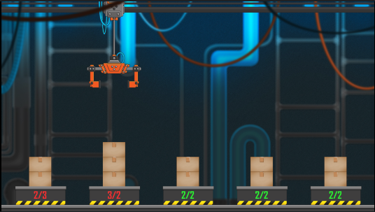

**# Robotic Leveling**

### Goal
Distribute the boxes evenly across the factory, ensuring each stack has the same number of boxes. 

### Rules
You operate in an automated factory that utilizes a simple robotic arm to manipulate boxes. The arm can grasp a box from one stack and deposit it onto another. Initially, all boxes are placed on one or more stacks. Your objective is to rearrange the stacks so that each has an equal number of boxes. If this is not feasible, any excess boxes will be stacked horizontally from left to right. 

Your program receives periodic updates about the current state of the arm and the box counts for each stack. To succeed, your function must generate a sequence of commands that leads to the correct positioning of the boxes within the given constraints. 

Available Commands
-------------------

* `RIGHT`: Move the arm one stack to the right.
* `LEFT`: Move the arm one stack to the left.
* `PICK`: Grab a box from the stack directly below the arm.
* `PLACE`: Place a box onto the stack directly below the arm.

### Implementation
Implement the function `solve(clawPos, boxes, boxInClaw)` that takes three arguments:

* `clawPos`: The index of the stack the arm is currently above (an integer).
* `boxes`: An array of integers representing the size of each stack.
* `boxInClaw`: A boolean value indicating whether the arm is carrying a box (1) or not (0).

Victory Conditions
----------------

* All stacks have been smoothed horizontally.

Loss Conditions
---------------

* Your function returns an incorrect command.
* The stacks still aren't smoothed after 200 turns.

Constraints
------------

* 2 ≤ number of stacks ≤ 8
* 1 ≤ number of boxes ≤ 16

### Example Game Preview

